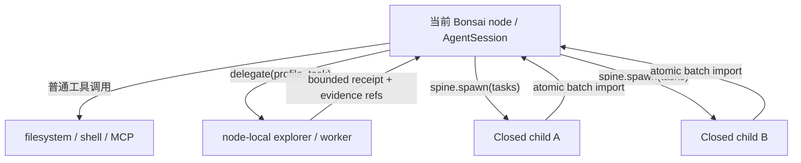

# Bonsai 设计记录

> 状态：Phase 1 SDD 已进入 Review，尚未进入实现或部署。
>
> 记录规则：本文将“源码事实”“已确认决定”“设计提案”“待决事项”分开。提案在进入 SDD 规格前不视为最终契约。

## 1. 产品目标与当前范围

Bonsai 的第一阶段不是建设独立 agent runtime，而是在 pi 的现有 coding-agent runtime 中移植并产品化 SpineJIT 与 SpineSpawn：

1. Phase 1A：完整移植 SpineJIT 的任务树、状态转换、上下文投影、epoch 和 trim。
2. Phase 1B：在单 node 闭环稳定后，实现进程内 SpineSpawn。
3. pi 原生 compaction 在 Phase 1 继续兜底；Bonsai native compactor 和其他增强进入独立未来 SDD。

Phase 1 的非目标：

- 不另起一个 Bonsai 内核或独立 runtime。
- 不把所有 subagent 调用都建模成 Bonsai Task Tree 节点。
- 不为了兼容 pi 旧机制建设额外的 fallback 管理器。
- 不在 Phase 1 交付 node-local delegate profiles、调度器或 receipt runtime。
- 不在 Phase 1 交付结构化 TaskStateCore、supersede、evidence refs、execution journal 或自动 spawn recovery。
- 不在架构契约成熟前实现或部署代码。

## 2. 三类运行实体

### 2.1 Node agent

Bonsai Task Tree 中当前 node 的主 AgentSession。它拥有当前任务的详细上下文，可以调用普通工具和 Spine 控制工具。角色型 subagent 属于后续扩展。

### 2.2 SpineSpawn child

由 `spine.spawn` 创建的真正任务分支：

- 使用进程内 AgentSession，不启动额外 pi 进程。
- 从父 node 的 Spine 投影产生 fission 副本。
- 默认继承相同 system prompt、模型、thinking、工具和权限；权限只能收窄。
- branch task 作为稳定公共前缀后的尾部 user message。
- 父 node 等待整批 child 进入终态。
- 只有完整、合法的 typed receipt 才能把整批 Closed child 原子导入 Task Tree。

SpineSpawn child 改变 Bonsai Task Tree 的拓扑。

### 2.3 Node-local delegate

`explorer`、`worker` 等角色型 subagent 是当前 node 内部的上下文外包工具：

- 使用预定义 system prompt、工具集、最大权限和输出 schema。
- 可根据 profile 使用更便宜或能力较低的模型。
- 默认不创建 Bonsai Task Tree 节点。
- 完整 transcript 留在独立 session/trace 中。
- 当前 node 只接收有界 typed receipt 和证据引用。
- 生命周期、取消和资源归属挂在调用它的 node 上。
- 不允许递归调用 `delegate`。
- 不拥有任何 `spine.*` 权限，包括 `spine.spawn`。

因此它不改变任务树结构，但会影响 node 的执行语义。需要由 runtime 统一处理权限收窄、并发预算、取消传播、trace 归属和回执校验。



关键约束：delegate 只有在 receipt 有硬上限且大证据通过引用返回时才真正节省主 node 上下文。如果把完整 transcript 或大段文件内容回灌给父 node，它只转移了计算，没有节省上下文。

已确认限制：delegate 不拥有 `spine.*`，也不能再次调用 `delegate`。这样可以保证它只是 node 内的深模块，而不会在 Task Tree 之外暗中形成第二套递归调度结构。未来若需要递归协作，应显式升级为 SpineSpawn 或另行定义可观察的 delegation graph。

## 3. 两棵树与三个上下文层次

pi 的 Session Entry Tree 与 Bonsai Task Tree 是不同结构：

- Session Entry Tree 是持久化会话条目的分支和恢复结构。
- Bonsai Task Tree 是模型通过 Spine 控制事件表达的任务结构。
- node-local delegate 可能拥有独立 session/trace，但不因此成为 Bonsai Task Tree 节点。

Bonsai 上下文管理分为三个正交层次：

1. Spine projection：Closed subtree 用结构化 Node Memory 投影，Live/Opened node 保留工作细节。
2. Delegation offload：把局部搜索或执行交给角色型 subagent，只返回有界 receipt。
3. Native compaction：当 root 或长期 live task 仍持续增长时，切换到新的 context epoch。

SpineJIT 不能替代第三层。只要 root/live node 可能长期不关闭，就仍需要一套纯底层 compaction。

## 4. Spine 控制契约

### 已确认决定

- 模型提出 `open`、`close`、`next`、`spawn`，确定性 reducer 决定控制事件是否合法。
- 原始 rollout append-only，Task Tree 可由控制事实重放得到。
- Closed node 不 reopen；修正使用后续 supersede 事件，不改写旧事实。
- 冲突处以 Spine 机制替换 pi 旧机制。
- 若 pi 原机制无需额外管控即可自然兜底，可以保留；否则直接替换，不建设双机制协调层。
- Spine 控制工具采用 batch 级约束：一次模型响应最多一个 spawn，spawn 不与 open/close/next 混用。

### 早期接口草案

```text
spine.open(summary)
spine.close(outcome, memory)
spine.next(summary, outcome, memory)
spine.spawn(tasks[])
delegate(profile, task, expected_output?, budget?) -> DelegateReceipt
```

该草案中的 `MemoryEntry` 已收敛为 `NodeMemoryEnvelope + TaskStateCore`。`DelegateReceipt` 已下放到后续独立 SDD，不是 Phase 1 interface。

## 5. Compaction 方向

### 已确认问题

pi 当前按固定 token 阈值选择 cut point，再以通用摘要继续会话。问题不只是“用 token 触发”，而是：

- cut point 与任务语义、工具调用配对和用户原文保护弱相关；
- 摘要目标不够定向；
- live task 的 continuation contract 太弱；
- 原始窗口的归档、追溯和恢复能力不足。

token/context pressure 仍适合作为硬安全信号，但不应独自决定删什么、摘要什么以及如何恢复。

### Fermi 源码事实

Fermi 也使用 token/context-budget 比率，不是非 token compaction。它的主要差异在策略：

- 结合有效 context 百分比与 output headroom 评估压力。
- 使用两级自然断点提醒和 hysteresis。
- global compact 前鼓励 `summarize_context` 生成定向摘要。
- 保护真实用户消息；mid-turn 只在 tool-call 路径触发。
- root 可以 auto-compact，child 在高压力时优先警告并要求收尾。
- compact phase 可用工具生成 continuation prompt。
- continuation 保存目标、进度、决策、artifact、用户规则和下一步。
- 旧窗口归档，plan snapshot 跨 compact 保留。
- `compact_marker + compact_context` 形成新窗口。

因此 Bonsai 不应简单照搬“Fermi 算法”，而应评估并吸收它的压力策略、定向摘要、continuation contract、归档和恢复设计。

### Harness 对比结论

四套实现的固定版本、完整比较和源码边界见 `research/compaction-harness-comparison.md`。当前判断：

- compactor 位于 Spine projection 之后，优先使用 node 状态而不是线性消息 cut point。
- 直接采用 Fermi 的 output headroom、soft/hard pressure 与 hysteresis 思路。
- 直接采用 Grok Build 的 summarizer 输入降级、tool-pair safe split、失败分类和 stale-cache 校验思路。
- 直接采用 Raven 的 lossless manifest/archive、deterministic validation 与 selection fallback 思路，但不引入 Curator 作为 Phase 1 必需自治 agent。
- append-only rollout 是唯一权威 archive；额外 manifest、cache 和压缩索引必须可重建。
- compact 产物必须 staged、validated、durably committed 后才能切换 live epoch。Grok Build 的 best-effort checkpoint send 后立即替换 history 不满足该契约。
- Phase 1 不默认启用 two-pass prefire；先保留带 epoch/cursor、prefix fingerprint、model id 和 policy version 的缓存接口。

### Bonsai compactor 的候选管线

以下管线已经收敛；semantic selection、跨 epoch 用户原文、成功 guard 与 hard-pressure fallback 已在第三组确认：

1. Pressure detection：token 占用作为硬限制，同时考虑 output headroom、最近工具结果增长、当前 turn 是否可安全中断。
2. Spine-aware selection：先投影 Closed subtree，再保护 active path、用户约束、未完成任务、决策、验证结果和 artifact 引用。
3. Lossless cleanup：只在 active path 内裁剪可引用的大工具结果，保持完整 assistant/tool group，原文仍留在 append-only rollout。
4. Continuation synthesis：生成结构化 continuation bundle，而非一段无 schema 的通用摘要。
5. Epoch transition：持久化成功后追加 compact marker，开始新 epoch。
6. Recovery：从 append-only rollout 重放旧 epoch，并为 rewind 或重新提取证据保留来源。

评价任何候选方案时统一比较：触发信号、选择/摘要策略、用户原文保护、tool pair 合法性、live-task continuity、archive/rewind、缓存命中、token 成本和任务质量。

## 6. 源码核实边界

### SpineCodex

核实版本：`15cfe2d8b00a0338602533ff2c338a16652a06af`。

- 管线为 rollout -> lexer -> reducer -> projection -> materialize -> model request。
- `open` 进入 child；`close` 关闭并回 parent；`next` 原子关闭并进入 sibling。
- Closed node 自动保留真实用户消息、Closed child memories 和模型生成的 Node Memory。
- `spawn` 先做整批容量预留，父等待全部分支终态，完整 typed receipt 通过校验后才整批导入。
- workspace/file/database 等外部副作用不具备事务性。
- 未发现进程在 active spawn 中崩溃后的自动 rejoin。
- 当前环境没有 `cargo`，以上是静态源码结论，不是 Rust 测试结论。

`close/next` 与 Node Memory 的聚焦复核见 `research/spinejit-close-memory.md`。据此默认直接采用：

- Handler admission 与 reducer replay 双重校验。
- 只有完整、成功、唯一的控制调用才能改变 Task Tree。
- runtime 自动保留真实 user messages 与全部 Closed child memories。
- close/next sampling boundary 的上下文归属规则。
- compact marker 创建新 root epoch，旧 epoch 不再自动投影。

值得偏离上游的候选只有：结构化 `MemoryEntry`、durable commit 后才确认控制成功，以及结构化 compact continuation。Memory 硬上限、用户原文去重、额外派生数据库、增量 reducer、二次模型审核和 reopen 均不在首版主动偏离；只有测量证明收益后再讨论。

Reducer 与 epoch 的聚焦复核见 `research/spinejit-reducer-epochs.md`。据此默认直接采用结构化 NodeId、单 cursor、完整 control group 原子归属、歧义控制 no-op、Closed 不可变、compact 创建新 epoch，以及旧 epoch 仅保留审计而不进入当前投影。第二组只讨论四个新增语义：outcome 提交、active child compact 策略、跨 epoch lineage 和 continuation 组装责任。

### pi

- `createAgentSession()` 可注入 runtime、resource/settings/session manager、模型和工具，支持进程内 child。
- `transformContext` 在每次 provider 请求前执行，可作为 Spine projection 的宿主接缝。
- assistant/tool-result 完整结束时会持久化，可把成功控制调用组作为 reducer 的输入事实。
- 默认工具 batch 可并行，Spine 控制需要增加 batch 级约束。
- `sessionId` 同时承担生命周期标识和 OpenAI `prompt_cache_key`。SpineSpawn 需要独立 child identity 又希望复用父前缀缓存；Phase 1 已决定不拆分，只记录 cache metrics 后再评估。
- 新的 agent session/context 层尚不能替代当前 coding-agent 宿主；当前 Phase 1 仍落在 `packages/coding-agent`。

### Fermi

本轮参考：

- `/Users/paxton/Fermifixed/src/session/context-manager.ts`
- `/Users/paxton/Fermifixed/src/session/compact-prompts.ts`
- `/Users/paxton/Fermifixed/src/session.ts`
- `/Users/paxton/Fermifixed/src/active-context.ts`

## 7. 当前收敛状态

Phase 1 当前只冻结 Spine parity 与模块依赖：

1. model、reducer、projection 是不依赖 pi runtime 的纯核心模块。
2. tools 负责 open、close、next、trim 的输入校验和 pi tool 定义。
3. integration 负责 SessionManager、tool 注册和 transformContext 的 pi 接入。
4. spawn 是唯一直接管理 child AgentSession 的模块，使用现有 createAgentSessionFromServices()，不增加 child factory 或独立 runtime。
5. Node Memory 使用上游 string 语义；pi compaction 继续兜底。
6. spawn 继承 pre-response projected context，完整 receipt 才原子导入。
7. Phase 1 不实现自动 rejoin、crash salvage、execution journal 或 cache identity 拆分。

已讨论的未来能力已迁移：

- context、memory、evidence、compaction 和 recovery：`sdd-context-evolution.md`。
- node-local delegate：`sdd-node-delegation.md`。
- 其他未成熟模块：`future-sdds.md`。

## 8. SDD Review 闸门

Phase 1A 的规格至少要冻结：

- 控制事件 schema 与合法状态转换。
- projection 的消息保留规则和顺序。
- string Node Memory 的生成与投影行为。
- compact marker 与 Spine epoch 的关系。
- trim 的 identity 与 tool-pair 行为。
- 验收测试矩阵。

Phase 1B 还需额外冻结：

- child AgentSession 的构造与继承规则。
- spawn 并发、取消、join 和 typed receipt 协议。
- incomplete receipt、取消和进程崩溃的 no-import 语义。
- child 权限和 nested spawn 限制。

旧的 structured memory、native compaction 和 durable recovery 闸门不再属于 Phase 1。主 SDD 完成一致性检查后可进入 Review，但状态提升不授权实现。

## 9. 讨论日志

### 2026-08-17

- 确认 Phase 1 聚焦将 SpineJIT、SpineSpawn 移植到 pi，不建设独立 Bonsai runtime。
- 确认 SpineSpawn child 使用进程内 AgentSession，并采用父 node fission 继承模型。
- 确认角色型 subagent 与 SpineSpawn 正交：前者是 node-local 工具，后者是 Task Tree 分支。
- 确认 node-local delegate 禁止调用任何 `spine.*`，也禁止递归 delegate。
- 确认 SpineJIT 无法覆盖长期 root/live task，仍需原生 compaction。
- 校正对 Fermi 的理解：其触发仍基于 token/context pressure，值得吸收的是定向摘要、continuation、归档和恢复策略。
- 下一轮重点：比较 pi、Fermi 和其他 harness 的 compaction 范式，先冻结评价标准，再选择 Bonsai 的底层 compactor 契约。
- 建立持续演进的 SDD；在实施前提成熟前保持 `Incubating`，不发布为实施任务。
- 完成 SpineJIT close/next memory 聚焦源码复核；开源实现已有答案的机制默认直接采用。
- 第一组只讨论三个高收益偏离点：Memory 表示、Closed outcome、runtime evidence capture。
- 第一组决定：采用结构化事实与可读渲染；`Closed` 与 `outcome` 分离；runtime 从可信 typed tool receipts 自动附加证据。
- 完成 reducer/epoch 聚焦源码复核；上游状态机与消息归属规则默认直接采用。
- 第二组问题限定为 outcome 提交、active child compact、跨 epoch lineage 与 continuation 组装责任。
- 第二组决定：outcome 必须显式提交；采用 soft/hard 两级 compact；新 epoch 保存 `continuesFrom`；continuation 由 runtime 组装硬事实、模型补充语义。
- 完成 pi、Fermi、Grok Build 与 Raven 的 compaction 源码对比；固定版本与证据边界记录在 `research/compaction-harness-comparison.md`。
- 直接采用 output headroom、hysteresis、tool-pair 原子边界、summarizer fit ladder、staged validation、durable commit 和 deterministic selection fallback 等 correctness 机制。
- Phase 1 不默认启用 Grok two-pass prefire，也不引入 Raven Curator 作为必需自治 agent。
- 第三组只讨论 semantic selection、跨 epoch 用户原文、成功 guard 与 hard-pressure runtime fallback。
- 第三组决定：semantic selection 由 runtime 按 Spine 语义确定；跨 epoch 使用有界 verbatim user bundle；成功条件采用 target-headroom guard；hard pressure 下允许经过相同校验的 runtime-only continuation。
- 明确不把全部历史 user messages 重新注入新 epoch；未进入 verbatim bundle 的原文仍保存在 append-only rollout，并通过 refs 追溯。
- 完成 Node Memory 与 Continuation schema 的开源实现对比；没有实现同时提供 typed stable task facts、source refs、lineage 与 runtime resume state。
- 第四组限定为 shared core、stable/runtime 分层、跨 epoch active operations 与 bundle 预算策略。
- 第四组决定：Node Memory 与 Continuation 共享 versioned `TaskStateCore`；stable facts 与 runtime resume snapshot 分层；只有带 runtime-owned resumable handle 的 operation 可跨 epoch；bundle 使用总预算加类别优先级预算。
- 用户将 shared-core 选择委托给设计判断；采用 A，因为目标、约束、决策、进度、下一步和 evidence refs 在 close 与 compact 间具有相同语义，独立 schema 会产生重复转换和漂移。
- 完成 pi session persistence 与 Spine control replay 的聚焦对比。确认继续使用完整 message/tool-result group 作为权威事实，不另建第二份可变 Task Tree 数据库。
- pi 当前同步 append 没有显式 fsync，且内存 entry 先于 persistence 更新；Phase 1A 需要 durable group commit barrier，失败时回到最后 durable prefix。
- 第五组限定为外部副作用不确定、supersede 范围和 torn/corrupt tail 恢复。
- 第五组决定：外部副作用不确定时进入 `indeterminate_external_effect`，禁止自动重试；supersede 只替换 projected semantic facts/outcome，不改写历史或 reopen；损坏 session tail 恢复最长合法 durable prefix 并进入显式 recovery/read-only 状态。
- 确认模型可见的恢复结果必须是 pi 原生 `ToolResultMessage` error：`isError: true`，内容携带稳定错误码和 `retryable: false`。若没有匹配的 durable tool call，则不得生成破坏 provider pairing 的孤立 tool result。
- 直接复用 SpineJIT 的 `Failed` / incomplete control group tree no-op 语义；上游没有覆盖外部副作用崩溃窗口，因此 Bonsai 额外要求 durable operation intent 与状态验证。
- 完成 `TaskStateCore` 字段组织的源码复核。SpineJIT 只有 opaque memory string，pi compaction 只有 Markdown sections 和整体 session migration，没有 typed fact identity 可直接复用。
- 第六组限定为 work-item 归一化、supersede 粒度、objective cardinality 与非破坏性 schema migration。
- 用户授权剩余架构选择默认采用推荐 A；只有推荐方案明显扩大 interface 或成本收益失衡时才简化，并必须在 SDD 中记录原因，不再逐组请求确认。
- 第六组决定：单 primary objective；统一 `workItems[]`；facts 使用稳定 `factId + revision` 做细粒度 supersede；schema 通过非破坏性 decode chain 迁移，未知未来版本进入 recovery/read-only。
- Phase 1A 采用单一 `prepareRequest(...)` 深模块，冻结 projection 顺序、provider pairing、Node Memory failure、compaction policy v1、archive/rewind 与真实 AgentSession 测试 interface。
- Phase 1B 采用单一 `spawnBatch(...)` 深模块，冻结 immutable parent snapshot、admission、资源/权限 policy、typed receipt、取消和 bounded crash salvage。
- 发现 pi 新 `AgentHarness` 已定义 `ToolStartedRecord` 与 `replay: never | safe`，因此 Bonsai 不另建 operation-intent 协议；当前执行方法仍未实现，Phase 1 只做 coding-agent 兼容 adapter。
- node-local delegate 从 Phase 1 交付目标下放到后续独立 SDD；Phase 1 只保留不得递归、不得调用 `spine.*` 和不得扩权的兼容约束。
- 按成本收益明确采用三项简化：不拆 session/cache identity；不自动 rejoin active spawn；首版不注册跨 epoch active-operation adapter。
- 核心 interface、failure/recovery 语义、资源/权限 policy 和验收矩阵已收敛，主 SDD 可从 `Incubating` 提升为 `Review`；仍无实施、提交或部署授权。
- 经 Ponytail 复审，确认上述方案把 Bonsai 未来增强提前塞入 Phase 1，模块数量和持久化契约超过 Spine parity 所需范围。
- Phase 1 重新收敛为完整 SpineJIT 与 SpineSpawn 移植；保留 reducer、projection、tools、spawn 和 pi integration 的模块职责。
- structured Node Memory、native compaction、evidence、supersede、execution journal、spawn recovery 与 node-local delegate 均迁移到独立未来 SDD。
- pi 原生 compaction 在 Phase 1 继续兜底；只有实现测试证明其破坏 Spine projection correctness 时才做最小冲突修复。
